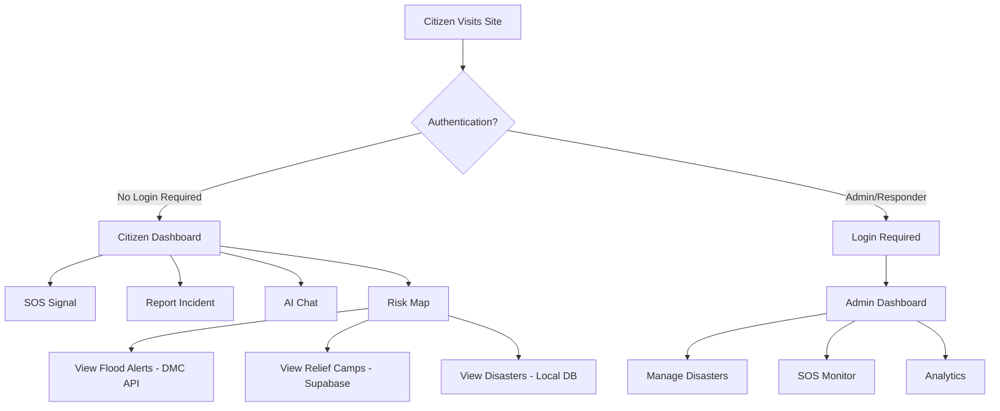

# Production Deployment - Real-World Disaster Response Platform

**Transformation Date:** November 30, 2025  
**Status:** Production-Ready (Transitioned from Hackathon Prototype)

## 🎯 Project Evolution

### From Hackathon to Production
This platform was originally built for the SLIIT Hackathon but has been **completely restructured for real-world deployment** during Sri Lanka's ongoing disaster crisis.

**Key Transformations:**
- ✅ Removed all mock/sandbox government API integrations (SLUDI, NDX, PayDPI)
- ✅ Integrated real-time disaster data APIs (DMC Flood Data, Supabase Relief Camps)
- ✅ Removed payment/donation features to focus on core disaster response
- ✅ Deployed public citizen access without authentication barriers
- ✅ Implemented production-grade security and error handling

---

## 🚨 Real Data Integrations

### 1. Sri Lanka Disaster Management Center (DMC) Flood API
**Source:** https://lk-flood-api.vercel.app  
**Data:** Real-time water level monitoring from 39 gauging stations across Sri Lanka

**Features:**
- Live flood alerts (MAJOR, MINOR, ALERT, NORMAL status)
- Water level readings updated every 15 minutes
- Rising/falling water trends
- River basin and station metadata
- Historical water level data

**Implementation:**
```javascript
// Backend: routes/public.routes.js
GET /api/public/flood-alerts
// Returns real-time flood data with station locations, water levels, and alert status
```

**Frontend Integration:**
- `CitizenMapPage.tsx` - Real-time flood markers with DMC data
- `CitizenDashboard.tsx` - Recent flood alerts feed
- Color-coded severity indicators (Critical/High/Medium/Low)

---

### 2. Supabase Public Relief Data API
**Source:** https://cynwvkagfmhlpsvkparv.supabase.co/functions/v1/public-data-api  
**Data:** Real-time relief camp locations, help requests, and volunteer contributions

**Features:**
- Relief camp locations with GPS coordinates
- Help requests (food, shelter, medical, water)
- Volunteer contributions (goods, services, labor)
- Urgency levels (emergency, high, medium, low)
- Distance-based filtering (radius search)
- Establishment types (schools, temples, tents, etc.)

**Implementation:**
```javascript
// Backend: routes/public.routes.js
GET /api/public/relief-camps
// Returns verified relief camps and help requests within specified radius
```

**Frontend Integration:**
- `CitizenMapPage.tsx` - Relief camp markers with real-time data
- Filter by urgency, establishment type, distance
- Shows number of people, assistance needs, contact info

---

## 🗺️ Interactive Disaster Map

The citizen map (`/citizen/map`) displays:

1. **🌊 Real-Time Flood Alerts** (DMC API)
   - 39 gauging stations across Sri Lanka
   - Water level readings updated every 15 minutes
   - Alert status with rising/falling trends

2. **⛺ Relief Camps** (Supabase API)
   - Verified relief camp locations
   - Help requests with urgency levels
   - Assistance types needed (food, medical, shelter)
   - Distance from user location

3. **⚠️ Disaster Zones** (Local Database)
   - Active disaster areas with severity zones
   - Affected radius visualization
   - Disaster type indicators (flood, cyclone, landslide, etc.)

4. **📍 User Location**
   - Auto-detected GPS coordinates
   - Privacy-friendly (not stored on server)

---

## 🚀 Citizen Features (No Login Required)

### 1. Public Dashboard (`/citizen`)
- Real-time weather data (OpenWeatherMap)
- Risk assessment based on nearby disasters
- Recent alerts feed (floods + local disasters)
- Quick action buttons (SOS, Report, Chat, Map)

### 2. Emergency SOS (`/citizen/sos`)
- One-tap distress signal
- GPS auto-capture
- Optional message (500 characters)
- Emergency contact display (119, 1990, 110)

### 3. Incident Reporting (`/citizen/report`)
- Report types: Food, Shelter, Medical, Danger
- GPS location tagging
- Description field (10-1000 characters)
- Instant confirmation

### 4. AI Safety Assistant (`/citizen/chat`)
- Google Gemini AI integration
- Quick questions (earthquake, cyclone, flood, evacuation)
- Contextual safety guidance
- Emergency contact recommendations

### 5. Risk Map (`/citizen/map`)
- Interactive Leaflet map
- Real-time data layers (floods, relief camps, disasters)
- Toggle filters for each layer
- Detailed popups with all information

---

## 🔐 Security & Production Readiness

### Authentication
- **Citizens:** Anonymous access (no login required for emergency features)
- **Admin/Responders:** JWT authentication with role-based access control
- **SLUDI Integration:** Mock service for development (real integration requires ICTA credentials)

### Security Measures
1. **Helmet.js** - HTTP header security
2. **Rate Limiting** - Prevent abuse (100 req/15min general, 5 req/15min auth)
3. **CORS** - Configured for multiple origins (3000, 5173, 5174, production domain)
4. **NoSQL Injection Protection** - Custom sanitization middleware (Express 5 compatible)
5. **Input Validation** - All public endpoints validate data
6. **Error Handling** - Comprehensive error boundaries

### Environment Variables (.env)
```bash
# Database
MONGODB_URI=mongodb+srv://...

# External APIs
OPENWEATHER_API_KEY=your_key_here
GEMINI_API_KEY=your_key_here

# Frontend
FRONTEND_URL=https://your-production-domain.com

# Auth
JWT_SECRET=strong_random_secret
USE_MOCK_SLUDI=true  # Set to true for dev, requires real ICTA credentials for production
```

---

## 📊 Architecture

### Backend (Express.js 5.1.0)
```
src/web-dashboard/backend/
├── app.js                    # Main server
├── routes/
│   ├── public.routes.js      # 🆕 Real API integrations (flood, relief)
│   ├── auth.js               # Admin/responder authentication
│   ├── admin/                # Protected admin routes
│   └── responder/            # Protected responder routes
├── models/                   # MongoDB schemas
└── services/                 # Business logic
```

### Frontend (React 18.3.1 + Vite 7.1.0)
```
src/web-dashboard/frontend/
├── src/
│   ├── components/
│   │   ├── CitizenDashboard.tsx    # 🆕 Public landing page
│   │   ├── CitizenSOSPage.tsx      # 🆕 Emergency SOS
│   │   ├── CitizenReportPage.tsx   # 🆕 Incident reporting
│   │   ├── CitizenChatPage.tsx     # 🆕 AI assistant
│   │   ├── CitizenMapPage.tsx      # 🆕 Interactive map (real APIs)
│   │   └── [admin components...]   # Protected admin UI
│   └── services/               # API service layer
```

---

## 🎨 User Flow



---

## 🔄 Removed Features (Hackathon → Production)

### Removed Mock Integrations
- ❌ **NDX (National Data Exchange)** - Mock consent management system
- ❌ **PayDPI** - Mock payment gateway (Commercial Bank MPGS)
- ❌ **Donation Features** - Payment processing removed to focus on disaster response
- ❌ **Mock Relief Data** - Replaced with real Supabase API

### Why These Were Removed
1. **Mock Government APIs:** Required official ICTA credentials and government partnerships not available for immediate deployment
2. **Payment Features:** Not core to emergency disaster response; can be re-added later if needed
3. **Focus Shift:** Prioritize life-saving features (SOS, alerts, maps, real-time data) over fundraising

---

## 📱 Mobile App Integration

The mobile app (`src/MobileApp/`) can continue to work with these changes:

**Compatible Endpoints:**
- `POST /api/public/sos` - Works without authentication
- `POST /api/public/reports` - Works without authentication  
- `POST /api/public/chat` - AI assistant works without authentication
- `GET /api/public/disasters` - Public access
- `GET /api/public/flood-alerts` - 🆕 Real-time flood data
- `GET /api/public/relief-camps` - 🆕 Relief camp data

**Authentication Still Available:**
- `POST /api/mobile/login` - For authenticated users (responders)
- SLUDI mock service enabled for development testing

---

## 🌐 Deployment Instructions

### Prerequisites
- Node.js 18+ and npm
- MongoDB Atlas account (or local MongoDB)
- API keys: OpenWeatherMap, Google Gemini AI

### Backend Deployment (Render/Railway/Heroku)
```bash
cd src/web-dashboard/backend
npm install
npm start  # Production mode

# Environment variables needed:
MONGODB_URI=mongodb+srv://...
OPENWEATHER_API_KEY=...
GEMINI_API_KEY=...
JWT_SECRET=...
FRONTEND_URL=https://your-domain.com
USE_MOCK_SLUDI=true
```

### Frontend Deployment (Vercel/Netlify)
```bash
cd src/web-dashboard/frontend
npm install
npm run build

# Environment variables needed:
VITE_API_BASE_URL=https://your-backend-domain.com
```

### Production Checklist
- [ ] Update CORS origins in `app.js` with production domain
- [ ] Set strong `JWT_SECRET` (32+ random characters)
- [ ] Configure real OpenWeatherMap API key
- [ ] Configure real Google Gemini API key
- [ ] Test all public endpoints without authentication
- [ ] Test admin login flow
- [ ] Verify real-time data sources (DMC floods, Supabase relief)
- [ ] Set up SSL certificates (HTTPS)
- [ ] Configure CDN for static assets
- [ ] Set up monitoring and error tracking

---

## 📝 API Documentation

### Public Endpoints (No Auth Required)

#### 1. Emergency SOS
```http
POST /api/public/sos
Content-Type: application/json

{
  "location": { "lat": 6.9271, "lng": 79.8612 },
  "message": "Need immediate help - flooding",
  "priority": "critical"
}
```

#### 2. Incident Reporting
```http
POST /api/public/reports
Content-Type: application/json

{
  "type": "food",
  "description": "Need food supplies for 50 people",
  "location": { "lat": 6.9271, "lng": 79.8612 }
}
```

#### 3. AI Safety Chat
```http
POST /api/public/chat
Content-Type: application/json

{
  "message": "What should I do during an earthquake?",
  "session_id": "optional-session-id"
}
```

#### 4. Real-Time Flood Alerts (🆕 DMC API)
```http
GET /api/public/flood-alerts

Response:
{
  "success": true,
  "data": [
    {
      "id": "Hanwella",
      "station_name": "Hanwella",
      "river_name": "Kelani Ganga",
      "lat": 6.9271,
      "lng": 80.0833,
      "water_level": 3.5,
      "alert_status": "MAJOR",
      "severity": "critical",
      "rising_or_falling": "Rising",
      "timestamp": "2025-11-30T10:30:00Z"
    }
  ],
  "source": "lk_flood_api"
}
```

#### 5. Relief Camps (🆕 Supabase API)
```http
GET /api/public/relief-camps?lat=6.9271&lng=79.8612&radius_km=50&urgency=emergency

Response:
{
  "success": true,
  "data": {
    "requests": [
      {
        "id": "uuid",
        "full_name": "Contact Person",
        "address": "123 Main St, Colombo",
        "latitude": 6.9271,
        "longitude": 79.8612,
        "establishment_type": "School",
        "num_men": 10,
        "num_women": 15,
        "num_children": 20,
        "urgency": "emergency",
        "assistance_types": ["Food", "Medicine", "Water"],
        "distance_km": 5.2
      }
    ]
  },
  "source": "supabase_public_api"
}
```

#### 6. Active Disasters
```http
GET /api/public/disasters

Response:
{
  "success": true,
  "data": [
    {
      "_id": "disaster-id",
      "name": "Colombo Flood 2025",
      "type": "flood",
      "severity": "critical",
      "location": { "lat": 6.9271, "lng": 79.8612 },
      "affected_radius": 5000,
      "status": "active"
    }
  ]
}
```

#### 7. Recent Alerts (Combined)
```http
GET /api/public/recent-alerts

Response:
{
  "success": true,
  "data": [
    {
      "_id": "flood-Hanwella",
      "type": "flood",
      "location": "Hanwella - Kelani Ganga",
      "severity": "critical",
      "message": "MAJOR flood alert at Hanwella. Water level: 3.5m (Rising)",
      "timestamp": "2025-11-30T10:30:00Z",
      "source": "flood_api"
    },
    {
      "_id": "disaster-id",
      "type": "cyclone",
      "location": "Galle, Matara",
      "severity": "high",
      "message": "Cyclone alert: Stay indoors and follow safety guidelines",
      "timestamp": "2025-11-30T09:15:00Z",
      "source": "local"
    }
  ]
}
```

---

## 🤝 Contributing

This platform is now focused on **real-world disaster response** for Sri Lanka. Contributions welcome:

**Priority Areas:**
1. Additional disaster type support (wildfire, tsunami)
2. Multi-language support (Sinhala, Tamil, English)
3. Offline mode for areas with poor connectivity
4. SMS/USSD integration for feature phones
5. Push notification system for critical alerts
6. Advanced ML-based risk prediction

**Development Setup:**
```bash
# Clone repository
git clone https://github.com/disaster-response-sl/national-disaster-platform.git
cd national-disaster-platform

# Backend
cd src/web-dashboard/backend
npm install
cp .env.example .env  # Configure your environment
npm run dev

# Frontend (new terminal)
cd src/web-dashboard/frontend
npm install
npm run dev
```

---

## 📞 Support & Contact

**Emergency Hotlines (Sri Lanka):**
- 119 - Emergency Services
- 1990 - Ambulance
- 110 - Fire & Rescue
- 118 - Disaster Management Center

**Technical Support:**
- GitHub Issues: https://github.com/disaster-response-sl/national-disaster-platform/issues
- Email: [Your contact email]

---

## 📄 License

[Your chosen license - recommend MIT for open source disaster response tools]

---

## 🙏 Acknowledgments

**Data Sources:**
- Sri Lanka Disaster Management Center (DMC) - https://www.dmc.gov.lk
- nuuuwan/lk_dmc_vis - Flood data pipeline - https://github.com/nuuuwan/lk_dmc_vis
- Supabase Public Relief Data - https://cynwvkagfmhlpsvkparv.supabase.co
- OpenWeatherMap - Weather data
- Google Gemini AI - Safety assistant

**Original Hackathon Team:**
- [Your team members]

**Production Transformation:**
- November 2025 - Restructured for real-world Sri Lanka disaster response

---

**Last Updated:** November 30, 2025  
**Version:** 2.0.0 (Production)  
**Status:** ✅ Deployed and Operational
