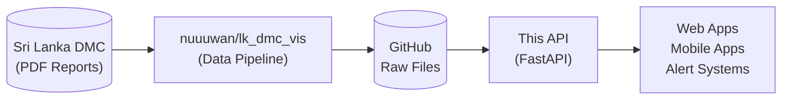

Sri Lanka Flood Data API
 1.0.0 
OAS 3.1
/openapi.json
REST API for Sri Lanka river water level and flood monitoring data. Data sourced from the Disaster Management Center (DMC) via nuuuwan/lk_dmc_vis.

GitHub Repository - Website
MIT
Stations


GET
/stations
List Stations

Get all gauging stations with their metadata and threshold levels.

Parameters
Try it out
No parameters

Responses
Code	Description	Links
200	
Successful Response

Media type

application/json
Controls Accept header.
Example Value
Schema
[
  {
    "name": "string",
    "river_name": "string",
    "lat_lng": [
      0
    ],
    "alert_level": 0,
    "minor_flood_level": 0,
    "major_flood_level": 0
  }
]
No links

GET
/stations/{name}
Get Station

Get a specific station by name with its latest water level reading.

Parameters
Try it out
Name	Description
name *
string
(path)
name
Responses
Code	Description	Links
200	
Successful Response

Media type

application/json
Controls Accept header.
Example Value
Schema
{
  "station": {
    "name": "string",
    "river_name": "string",
    "lat_lng": [
      0
    ],
    "alert_level": 0,
    "minor_flood_level": 0,
    "major_flood_level": 0
  },
  "latest_reading": {
    "station_name": "string",
    "river_name": "string",
    "water_level": 0,
    "previous_water_level": 0,
    "alert_status": "MAJOR",
    "flood_score": 0,
    "rising_or_falling": "string",
    "rainfall_mm": 0,
    "remarks": "string",
    "timestamp": "string"
  }
}
No links
422	
Validation Error

Media type

application/json
Example Value
Schema
{
  "detail": [
    {
      "loc": [
        "string",
        0
      ],
      "msg": "string",
      "type": "string"
    }
  ]
}
No links
Rivers


GET
/rivers
List Rivers

Get all rivers with their basin assignments.

Parameters
Try it out
No parameters

Responses
Code	Description	Links
200	
Successful Response

Media type

application/json
Controls Accept header.
Example Value
Schema
[
  {
    "name": "string",
    "river_basin_name": "string",
    "location_names": [
      "string"
    ]
  }
]
No links

GET
/rivers/{name}
Get River

Get a specific river by name.

Parameters
Try it out
Name	Description
name *
string
(path)
name
Responses
Code	Description	Links
200	
Successful Response

Media type

application/json
Controls Accept header.
Example Value
Schema
{
  "name": "string",
  "river_basin_name": "string",
  "location_names": [
    "string"
  ]
}
No links
422	
Validation Error

Media type

application/json
Example Value
Schema
{
  "detail": [
    {
      "loc": [
        "string",
        0
      ],
      "msg": "string",
      "type": "string"
    }
  ]
}
No links

GET
/rivers/{name}/stations
Get River Stations

Get all gauging stations on a specific river.

Parameters
Try it out
Name	Description
name *
string
(path)
name
Responses
Code	Description	Links
200	
Successful Response

Media type

application/json
Controls Accept header.
Example Value
Schema
[
  {
    "name": "string",
    "river_name": "string",
    "lat_lng": [
      0
    ],
    "alert_level": 0,
    "minor_flood_level": 0,
    "major_flood_level": 0
  }
]
No links
422	
Validation Error

Media type

application/json
Example Value
Schema
{
  "detail": [
    {
      "loc": [
        "string",
        0
      ],
      "msg": "string",
      "type": "string"
    }
  ]
}
No links
Basins


GET
/basins
List Basins

Get all river basins.

Parameters
Try it out
No parameters

Responses
Code	Description	Links
200	
Successful Response

Media type

application/json
Controls Accept header.
Example Value
Schema
[
  {
    "name": "string",
    "code": "string"
  }
]
No links

GET
/basins/{name}
Get Basin

Get a specific river basin by name.

Parameters
Try it out
Name	Description
name *
string
(path)
name
Responses
Code	Description	Links
200	
Successful Response

Media type

application/json
Controls Accept header.
Example Value
Schema
{
  "name": "string",
  "code": "string"
}
No links
422	
Validation Error

Media type

application/json
Example Value
Schema
{
  "detail": [
    {
      "loc": [
        "string",
        0
      ],
      "msg": "string",
      "type": "string"
    }
  ]
}
No links

GET
/basins/{name}/rivers
Get Basin Rivers

Get all rivers in a specific basin.

Parameters
Try it out
Name	Description
name *
string
(path)
name
Responses
Code	Description	Links
200	
Successful Response

Media type

application/json
Controls Accept header.
Example Value
Schema
[
  {
    "name": "string",
    "river_basin_name": "string",
    "location_names": [
      "string"
    ]
  }
]
No links
422	
Validation Error

Media type

application/json
Example Value
Schema
{
  "detail": [
    {
      "loc": [
        "string",
        0
      ],
      "msg": "string",
      "type": "string"
    }
  ]
}
No links
Water Levels


GET
/levels/latest
Get Latest Levels

Get the latest water level readings for all stations.

Parameters
Try it out
No parameters

Responses
Code	Description	Links
200	
Successful Response

Media type

application/json
Controls Accept header.
Example Value
Schema
[
  {
    "station_name": "string",
    "river_name": "string",
    "water_level": 0,
    "previous_water_level": 0,
    "alert_status": "MAJOR",
    "flood_score": 0,
    "rising_or_falling": "string",
    "rainfall_mm": 0,
    "remarks": "string",
    "timestamp": "string"
  }
]
No links

GET
/levels/history/{station_name}
Get Station History

Get historical water level readings for a specific station.

Parameters
Try it out
Name	Description
station_name *
string
(path)
station_name
limit
integer
(query)
Default value : 50

50
Responses
Code	Description	Links
200	
Successful Response

Media type

application/json
Controls Accept header.
Example Value
Schema
[
  {
    "station_name": "string",
    "river_name": "string",
    "water_level": 0,
    "previous_water_level": 0,
    "alert_status": "MAJOR",
    "flood_score": 0,
    "rising_or_falling": "string",
    "rainfall_mm": 0,
    "remarks": "string",
    "timestamp": "string"
  }
]
No links
422	
Validation Error

Media type

application/json
Example Value
Schema
{
  "detail": [
    {
      "loc": [
        "string",
        0
      ],
      "msg": "string",
      "type": "string"
    }
  ]
}
No links

GET
/levels/map
Get Flood Map

Get the current flood map image.

Parameters
Try it out
No parameters

Responses
Code	Description	Links
200	
Successful Response

Media type

application/json
Controls Accept header.
Example Value
Schema
"string"
No links

GET
/levels/chart/{station_name}
Get Station Chart

Get the chart image for a specific station.

Parameters
Try it out
Name	Description
station_name *
string
(path)
station_name
Responses
Code	Description	Links
200	
Successful Response

Media type

application/json
Controls Accept header.
Example Value
Schema
"string"
No links
422	
Validation Error

Media type

application/json
Example Value
Schema
{
  "detail": [
    {
      "loc": [
        "string",
        0
      ],
      "msg": "string",
      "type": "string"
    }
  ]
}
No links
Alerts


GET
/alerts
Get Active Alerts

Get all stations currently in ALERT, MINOR, or MAJOR status.

Parameters
Try it out
No parameters

Responses
Code	Description	Links
200	
Successful Response

Media type

application/json
Controls Accept header.
Example Value
Schema
[
  {
    "station_name": "string",
    "river_name": "string",
    "water_level": 0,
    "previous_water_level": 0,
    "alert_status": "MAJOR",
    "flood_score": 0,
    "rising_or_falling": "string",
    "rainfall_mm": 0,
    "remarks": "string",
    "timestamp": "string"
  }
]
No links

GET
/alerts/summary
Get Alert Summary

Get a summary count of stations by alert level.

Parameters
Try it out
No parameters

Responses
Code	Description	Links
200	
Successful Response

Media type

application/json
Controls Accept header.
Example Value
Schema
[
  {
    "alert_level": "MAJOR",
    "count": 0,
    "stations": [
      "string"
    ]
  }
]
No links
Dashboard


GET
/demo/stations
Dashboard

Interactive map showing all gauging stations with real-time alert status.

Parameters
Try it out
No parameters

Responses
Code	Description	Links
200	
Successful Response

Media type

application/json
Controls Accept header.
Example Value
Schema
"string"
No links
Health


GET
/health
Health Check

Parameters
Try it out
No parameters

Responses
Code	Description	Links
200	
Successful Response

Media type

application/json
Controls Accept header.
Example Value
Schema
"string"
No links

Schemas
AlertLevelExpand allstring
AlertSummaryExpand allobject
GaugingStationExpand allobject
HTTPValidationErrorExpand allobject
RiverExpand allobject
RiverBasinExpand allobject
StationWithLevelExpand allobject
ValidationErrorExpand allobject
WaterLevelReadingExpand allobject 

# Sri Lanka Flood Data API

REST API for Sri Lanka river water level and flood monitoring data.

**Live API:** https://lk-flood-api.vercel.app

| Documentation | URL |
|--------------|-----|
| Swagger UI | https://lk-flood-api.vercel.app/docs |
| ReDoc | https://lk-flood-api.vercel.app/redoc |
| OpenAPI Spec | https://lk-flood-api.vercel.app/openapi.json |

## Features

- Real-time water level data for 39 gauging stations
- Alert status classification (MAJOR, MINOR, ALERT, NORMAL)
- Historical water level readings
- River and basin information
- Flood map and station chart images

## API Documentation

### Swagger UI


### ReDoc


## Data Flow



## API Endpoints

### Health
| Method | Endpoint | Description |
|--------|----------|-------------|
| GET | `/health` | API health check |

### Stations
| Method | Endpoint | Description |
|--------|----------|-------------|
| GET | `/stations` | List all gauging stations |
| GET | `/stations/{name}` | Get station with latest reading |

### Rivers
| Method | Endpoint | Description |
|--------|----------|-------------|
| GET | `/rivers` | List all rivers |
| GET | `/rivers/{name}` | Get river details |
| GET | `/rivers/{name}/stations` | Get stations on a river |

### Basins
| Method | Endpoint | Description |
|--------|----------|-------------|
| GET | `/basins` | List all river basins |
| GET | `/basins/{name}` | Get basin details |
| GET | `/basins/{name}/rivers` | Get rivers in a basin |

### Water Levels
| Method | Endpoint | Description |
|--------|----------|-------------|
| GET | `/levels/latest` | Latest readings for all stations |
| GET | `/levels/history/{station}?limit=50` | Historical readings for a station |
| GET | `/levels/map` | Current flood map (PNG) |
| GET | `/levels/chart/{station}` | Station chart (PNG) |

### Alerts
| Method | Endpoint | Description |
|--------|----------|-------------|
| GET | `/alerts` | Stations in ALERT/MINOR/MAJOR status |
| GET | `/alerts/summary` | Count of stations by alert level |

### Dashboard
| Method | Endpoint | Description |
|--------|----------|-------------|
| GET | `/demo/stations` | Interactive map showing station locations and alert status |

## Local Development

```bash
# Create virtual environment
python -m venv .venv
source .venv/bin/activate  # On Windows: .venv\Scripts\activate

# Install dependencies
pip install -r requirements.txt

# Run the server
uvicorn app.main:app --reload
```

Visit http://localhost:8000/docs for interactive API documentation (Swagger UI).

## Data Source & Acknowledgments

This API consumes data from [**nuuuwan/lk_dmc_vis**](https://github.com/nuuuwan/lk_dmc_vis), an open-source data pipeline by [@nuuuwan](https://github.com/nuuuwan) that:

1. Fetches PDF flood reports from the [Sri Lanka Disaster Management Center (DMC)](https://www.dmc.gov.lk)
2. Parses and extracts water level data using OCR/PDF processing
3. Publishes structured JSON data to GitHub every 15 minutes

### Original Data Source

**Sri Lanka Disaster Management Center (DMC)**
- Website: [https://www.dmc.gov.lk](https://www.dmc.gov.lk)
- Reports: [River Water Level & Flood Warnings](https://www.dmc.gov.lk/index.php?option=com_dmcreports&view=reports&Itemid=277&report_type_id=6&lang=en)

The DMC is the official government agency responsible for disaster management in Sri Lanka, operating under the Ministry of Defence.